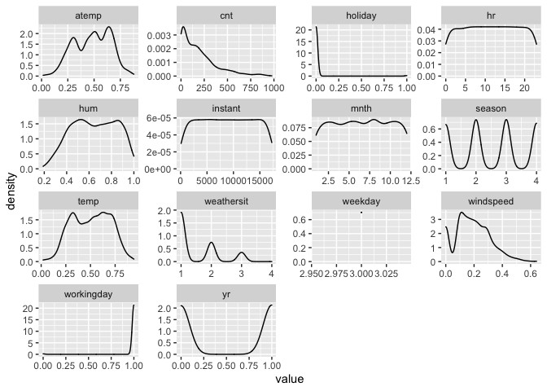
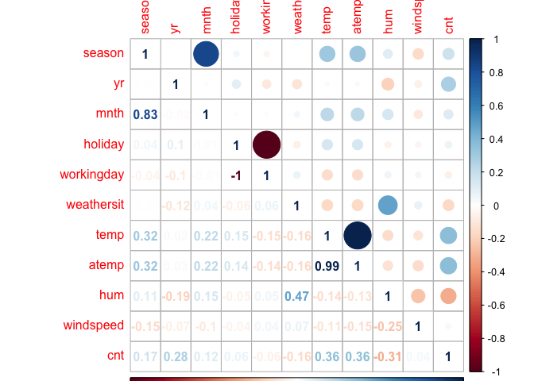

Project2
================
Lin Li

# Introduction

For this project, I will use bike sharing data to do analysis. There are
15 variables :  
\-instant(record index)  
\-dteday(date)  
\-season(1:winter, 2:spring, 3:summer, 4:fall)  
\-yr(0: 2011, 1:2012)  
\-mnth(month: 1 to 12)  
\-hr(hour:0 to 23)  
\-holiday(weather day is holiday or not)  
\-weekday(day of week)  
\-workingday(1 for neither weekend nor holiday,0 otherwise)  
\-weathersit(1: Clear, Few clouds, Partly cloudy, Partly cloudy,2: Mist
and Cloudy, Mist andBroken clouds, Mist and Few clouds, Mist,3: Light
Snow, Light Rain and Thunderstorm and Scattered clouds, Light Rain and
Scattered clouds,4: Heavy Rain and Ice Pallets and Thunderstorm and
Mist, Snow and Fog )  
\-temp(Normalized temperature in Celsius)  
\-atemp( Normalized feeling temperature in Celsius)  
\-hum(Normalized humidity),windspeed(Normalized wind speed)  
\-cnt(count of total rental bikes including both casual and registered )

The purpose of this analysis is to create models for predicting cnt
variable using others predictors mentioned above. Two models are
created:classification tree model using leave one out cross validation,
boosted tree model using cross validation.

# Data

``` r
# relative path to read data
#getwd()
day<-read.csv('day.csv')
day<-day%>%select(-c('casual','registered'))
hour<-read.csv('hour.csv')
hour<-hour%>%select(-c('casual','registered'))
# combine two data and get a new one
data<-semi_join(hour,day,by='dteday')
# filter Monday out
date<- filter(data,weekday==params$weekday)
set.seed(100)
# set train/test set
index<-createDataPartition(date$cnt,p=0.7,list=FALSE)
trainday<-date[index,]
testday<-date[-index,]
```

# Summarization

In this section, I summarize information for Monday, draw density plots
for all variables, and plot a correlation plot for cnt with others
predictors. From density plots, I can conclude the distributions for
variables. From correlation plot, I can conclude correlation
relationships between each variable.

``` r
# summary for monday
#summary(date)
# density plot
date %>%keep(is.numeric) %>%pivot_longer(everything()) %>%ggplot(aes(x = value)) +facet_wrap(~ name, scales = "free")+
geom_density()
```

<!-- -->

``` r
# all predictors' correlation with cnt variable
correlation <- cor(select(date,season,yr,mnth,holiday,workingday,weathersit,temp,atemp,hum,windspeed,cnt))
corrplot(correlation, type = "upper", tl.pos = "lt",na.label = "NA")
corrplot(correlation, type = "lower", method = "number", add = TRUE, tl.pos = "n",na.label = "NA")
```

<!-- -->

# Modeling

Two models are created for predicting cnt of Monday: First is
classification model using leave one out cross validation. Second is
boosted tree model with cross validation. I read in data and split into
training and test.Then centered and scaled data, and fitted models using
methods mentioned.  
Through comparing RMSE for test dataset, choose the one with smaller
RMSE as final model.

``` r
# fit model 
classification.fit<-train(cnt~season+mnth+hr+holiday+workingday+weathersit+temp+atemp+hum+windspeed,trainday,method='rpart',preProcess = c('center','scale'),trControl=trainControl(method='LOOCV'))
classification.fit
```

    ## CART 
    ## 
    ## 1734 samples
    ##   10 predictor
    ## 
    ## Pre-processing: centered (10), scaled (10) 
    ## Resampling: Leave-One-Out Cross-Validation 
    ## Summary of sample sizes: 1733, 1733, 1733, 1733, 1733, 1733, ... 
    ## Resampling results across tuning parameters:
    ## 
    ##   cp          RMSE      Rsquared      MAE     
    ##   0.06447063  153.7517  0.3772323123  113.0342
    ##   0.08547342  180.3791  0.1691322966  133.0920
    ##   0.29177018  199.2285  0.0005521944  170.0068
    ## 
    ## RMSE was used to select the optimal model using the smallest value.
    ## The final value used for the model was cp = 0.06447063.

``` r
boosted.fit<-train(cnt~season+yr+mnth+hr+holiday+workingday+weathersit+temp+atemp+hum+windspeed,trainday,method='gbm',preProcess = c('center','scale'),trControl=trainControl(method='repeatedcv'), verbose = FALSE)
boosted.fit
```

    ## Stochastic Gradient Boosting 
    ## 
    ## 1734 samples
    ##   11 predictor
    ## 
    ## Pre-processing: centered (11), scaled (11) 
    ## Resampling: Cross-Validated (10 fold, repeated 1 times) 
    ## Summary of sample sizes: 1561, 1561, 1560, 1560, 1560, 1562, ... 
    ## Resampling results across tuning parameters:
    ## 
    ##   interaction.depth  n.trees  RMSE       Rsquared   MAE     
    ##   1                   50      133.35991  0.5884305  90.95220
    ##   1                  100      117.66549  0.6656153  80.30725
    ##   1                  150      108.16400  0.7186766  73.48163
    ##   2                   50       93.71637  0.7998167  60.60087
    ##   2                  100       72.62506  0.8684405  48.18166
    ##   2                  150       67.96962  0.8791701  45.78560
    ##   3                   50       73.48369  0.8763686  48.23102
    ##   3                  100       58.50155  0.9106824  38.06440
    ##   3                  150       55.51598  0.9170124  35.56306
    ## 
    ## Tuning parameter 'shrinkage' was held constant at a value of 0.1
    ## Tuning parameter 'n.minobsinnode' was held
    ##  constant at a value of 10
    ## RMSE was used to select the optimal model using the smallest value.
    ## The final values used for the model were n.trees = 150, interaction.depth = 3, shrinkage = 0.1 and n.minobsinnode
    ##  = 10.

``` r
# predict
class<-predict(classification.fit,newdata = testday)
classRMSE<-sqrt(mean((class-testday$cnt)^2))
boost<-predict(boosted.fit,newdata = testday)
boostRMSE<-sqrt(mean((boost-testday$cnt)^2))
#RMSE for classification model and boost model
x<-c(classification=classRMSE,boost=boostRMSE)
knitr::kable(x,col.names =' RMSE')
```

|                |      RMSE |
| :------------- | --------: |
| classification | 142.75676 |
| boost          |  56.27953 |
