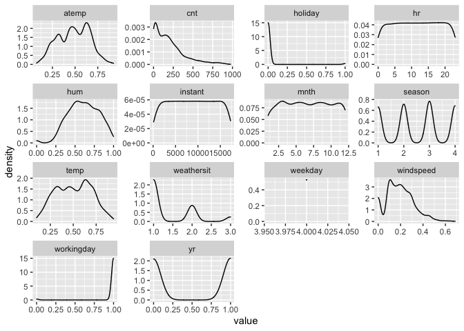
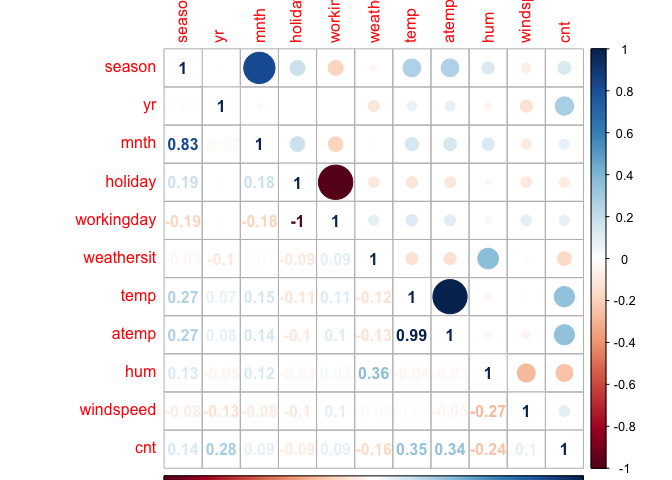

Project2
================
Lin Li

# Introduction

For this project, I will use bike sharing data to do analysis. There are
15 variables :  
\-instant(record index)  
\-dteday(date)  
\-season(1:winter, 2:spring, 3:summer, 4:fall)  
\-yr(0: 2011, 1:2012)  
\-mnth(month: 1 to 12)  
\-hr(hour:0 to 23)  
\-holiday(weather day is holiday or not)  
\-weekday(day of week)  
\-workingday(1 for neither weekend nor holiday,0 otherwise)  
\-weathersit(1: Clear, Few clouds, Partly cloudy, Partly cloudy,2: Mist
and Cloudy, Mist andBroken clouds, Mist and Few clouds, Mist,3: Light
Snow, Light Rain and Thunderstorm and Scattered clouds, Light Rain and
Scattered clouds,4: Heavy Rain and Ice Pallets and Thunderstorm and
Mist, Snow and Fog )  
\-temp(Normalized temperature in Celsius)  
\-atemp( Normalized feeling temperature in Celsius)  
\-hum(Normalized humidity),windspeed(Normalized wind speed)  
\-cnt(count of total rental bikes including both casual and registered )

The purpose of this analysis is to create models for predicting cnt
variable using others predictors mentioned above. Two models are
created:classification tree model using leave one out cross validation,
boosted tree model using cross validation.

# Data

``` r
# relative path to read data
#getwd()
day<-read.csv('day.csv')
day<-day%>%select(-c('casual','registered'))
hour<-read.csv('hour.csv')
hour<-hour%>%select(-c('casual','registered'))
# combine two data and get a new one
data<-semi_join(hour,day,by='dteday')
# filter Monday out
date<- filter(data,weekday==params$weekday)
set.seed(100)
# set train/test set
index<-createDataPartition(date$cnt,p=0.7,list=FALSE)
trainday<-date[index,]
testday<-date[-index,]
```

# Summarization

In this section, I summarize information for Monday, draw density plots
for all variables, and plot a correlation plot for cnt with others
predictors. From density plots, I can conclude the distributions for
variables. From correlation plot, I can conclude correlation
relationships between each variable.

``` r
# summary for monday
summary(date)
```

    ##     instant             dteday         season            yr              mnth             hr           holiday       
    ##  Min.   :  116   2011-01-13:  24   Min.   :1.000   Min.   :0.0000   Min.   : 1.00   Min.   : 0.00   Min.   :0.00000  
    ##  1st Qu.: 4410   2011-01-20:  24   1st Qu.:2.000   1st Qu.:0.0000   1st Qu.: 4.00   1st Qu.: 6.00   1st Qu.:0.00000  
    ##  Median : 8751   2011-02-17:  24   Median :3.000   Median :1.0000   Median : 7.00   Median :12.00   Median :0.00000  
    ##  Mean   : 8740   2011-03-03:  24   Mean   :2.522   Mean   :0.5042   Mean   : 6.59   Mean   :11.56   Mean   :0.01943  
    ##  3rd Qu.:13104   2011-03-17:  24   3rd Qu.:3.000   3rd Qu.:1.0000   3rd Qu.:10.00   3rd Qu.:18.00   3rd Qu.:0.00000  
    ##  Max.   :17283   2011-03-24:  24   Max.   :4.000   Max.   :1.0000   Max.   :12.00   Max.   :23.00   Max.   :1.00000  
    ##                  (Other)   :2327                                                                                     
    ##     weekday    workingday       weathersit         temp           atemp             hum           windspeed     
    ##  Min.   :4   Min.   :0.0000   Min.   :1.000   Min.   :0.100   Min.   :0.0758   Min.   :0.0000   Min.   :0.0000  
    ##  1st Qu.:4   1st Qu.:1.0000   1st Qu.:1.000   1st Qu.:0.340   1st Qu.:0.3333   1st Qu.:0.4700   1st Qu.:0.1045  
    ##  Median :4   Median :1.0000   Median :1.000   Median :0.500   Median :0.4848   Median :0.6100   Median :0.1940  
    ##  Mean   :4   Mean   :0.9806   Mean   :1.402   Mean   :0.507   Mean   :0.4850   Mean   :0.6096   Mean   :0.1920  
    ##  3rd Qu.:4   3rd Qu.:1.0000   3rd Qu.:2.000   3rd Qu.:0.660   3rd Qu.:0.6212   3rd Qu.:0.7600   3rd Qu.:0.2686  
    ##  Max.   :4   Max.   :1.0000   Max.   :3.000   Max.   :0.940   Max.   :0.9242   Max.   :1.0000   Max.   :0.6866  
    ##                                                                                                                 
    ##       cnt       
    ##  Min.   :  1.0  
    ##  1st Qu.: 42.0  
    ##  Median :154.0  
    ##  Mean   :196.4  
    ##  3rd Qu.:280.0  
    ##  Max.   :976.0  
    ## 

``` r
# density plot
date %>%keep(is.numeric) %>%pivot_longer(everything()) %>%ggplot(aes(x = value)) +facet_wrap(~ name, scales = "free")+
geom_density()
```

<!-- -->

``` r
# all predictors' correlation with cnt variable
correlation <- cor(select(date,season,yr,mnth,holiday,workingday,weathersit,temp,atemp,hum,windspeed,cnt))
corrplot(correlation, type = "upper", tl.pos = "lt",use="pairwise.complete.obs")
corrplot(correlation, type = "lower", method = "number", add = TRUE, tl.pos = "n",use="pairwise.complete.obs")
```

<!-- -->

# Modeling

Two models are created for predicting cnt of Monday: First is
classification model using leave one out cross validation. Second is
boosted tree model with cross validation. I read in data and split into
training and test.Then centered and scaled data, and fitted models using
methods mentioned.  
Through comparing RMSE for test dataset, choose the one with smaller
RMSE as final model.

``` r
# fit model 
classification.fit<-train(cnt~season+mnth+hr+holiday+workingday+weathersit+temp+atemp+hum+windspeed,trainday,method='rpart',preProcess = c('center','scale'),trControl=trainControl(method='LOOCV'))
classification.fit
```

    ## CART 
    ## 
    ## 1731 samples
    ##   10 predictor
    ## 
    ## Pre-processing: centered (10), scaled (10) 
    ## Resampling: Leave-One-Out Cross-Validation 
    ## Summary of sample sizes: 1730, 1730, 1730, 1730, 1730, 1730, ... 
    ## Resampling results across tuning parameters:
    ## 
    ##   cp          RMSE      Rsquared     MAE      
    ##   0.06212546  132.3144  0.508012603   93.29568
    ##   0.07512738  168.6555  0.223115817  120.01694
    ##   0.31544848  192.5287  0.004662878  164.95605
    ## 
    ## RMSE was used to select the optimal model using the smallest value.
    ## The final value used for the model was cp = 0.06212546.

``` r
boosted.fit<-train(cnt~season+yr+mnth+hr+holiday+workingday+weathersit+temp+atemp+hum+windspeed,trainday,method='gbm',preProcess = c('center','scale'),trControl=trainControl(method='repeatedcv'), verbose = FALSE)
boosted.fit
```

    ## Stochastic Gradient Boosting 
    ## 
    ## 1731 samples
    ##   11 predictor
    ## 
    ## Pre-processing: centered (11), scaled (11) 
    ## Resampling: Cross-Validated (10 fold, repeated 1 times) 
    ## Summary of sample sizes: 1559, 1558, 1558, 1557, 1558, 1557, ... 
    ## Resampling results across tuning parameters:
    ## 
    ##   interaction.depth  n.trees  RMSE       Rsquared   MAE     
    ##   1                   50      128.10168  0.5977682  86.80901
    ##   1                  100      113.29671  0.6735028  76.42796
    ##   1                  150      104.35422  0.7228836  70.67145
    ##   2                   50       89.97447  0.8059380  57.36831
    ##   2                  100       69.00992  0.8748757  46.39520
    ##   2                  150       63.98124  0.8871199  43.63482
    ##   3                   50       68.59272  0.8893406  45.83382
    ##   3                  100       52.01974  0.9270562  35.62464
    ##   3                  150       48.29539  0.9344582  32.89161
    ## 
    ## Tuning parameter 'shrinkage' was held constant at a value of 0.1
    ## Tuning parameter 'n.minobsinnode' was held
    ##  constant at a value of 10
    ## RMSE was used to select the optimal model using the smallest value.
    ## The final values used for the model were n.trees = 150, interaction.depth = 3, shrinkage = 0.1 and n.minobsinnode
    ##  = 10.

``` r
# predict
class<-predict(classification.fit,newdata = testday)
classRMSE<-sqrt(mean((class-testday$cnt)^2))
boost<-predict(boosted.fit,newdata = testday)
boostRMSE<-sqrt(mean((boost-testday$cnt)^2))
#RMSE for classification model and boost model
x<-c(classification=classRMSE,boost=boostRMSE)
knitr::kable(x,col.names =' RMSE')
```

|                |      RMSE |
| :------------- | --------: |
| classification | 127.90386 |
| boost          |  49.02405 |
