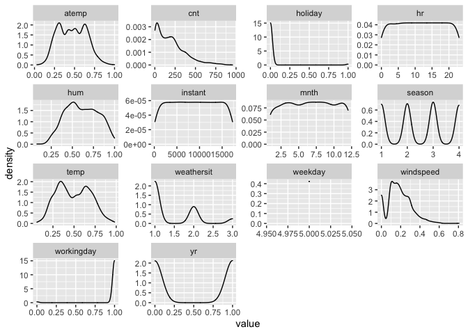
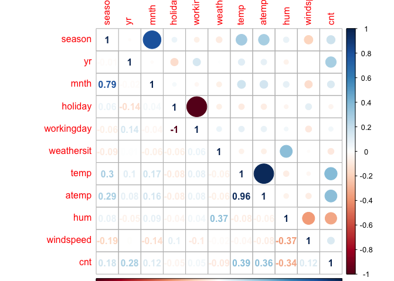

Project2
================
Lin Li

# Introduction

For this project, I will use bike sharing data to do analysis. There are
15 variables :  
\-instant(record index)  
\-dteday(date)  
\-season(1:winter, 2:spring, 3:summer, 4:fall)  
\-yr(0: 2011, 1:2012)  
\-mnth(month: 1 to 12)  
\-hr(hour:0 to 23)  
\-holiday(weather day is holiday or not)  
\-weekday(day of week)  
\-workingday(1 for neither weekend nor holiday,0 otherwise)  
\-weathersit(1: Clear, Few clouds, Partly cloudy, Partly cloudy,2: Mist
and Cloudy, Mist andBroken clouds, Mist and Few clouds, Mist,3: Light
Snow, Light Rain and Thunderstorm and Scattered clouds, Light Rain and
Scattered clouds,4: Heavy Rain and Ice Pallets and Thunderstorm and
Mist, Snow and Fog )  
\-temp(Normalized temperature in Celsius)  
\-atemp( Normalized feeling temperature in Celsius)  
\-hum(Normalized humidity),windspeed(Normalized wind speed)  
\-cnt(count of total rental bikes including both casual and registered )

The purpose of this analysis is to create models for predicting cnt
variable using others predictors mentioned above. Two models are
created:classification tree model using leave one out cross validation,
boosted tree model using cross validation.

# Data

``` r
# relative path to read data
#getwd()
day<-read.csv('day.csv')
day<-day%>%select(-c('casual','registered'))
hour<-read.csv('hour.csv')
hour<-hour%>%select(-c('casual','registered'))
# combine two data and get a new one
data<-semi_join(hour,day,by='dteday')
# filter Monday out
date<- filter(data,weekday==params$weekday)
set.seed(100)
# set train/test set
index<-createDataPartition(date$cnt,p=0.7,list=FALSE)
trainday<-date[index,]
testday<-date[-index,]
```

# Summarization

In this section, I summarize information for Monday, draw density plots
for all variables, and plot a correlation plot for cnt with others
predictors. From density plots, I can conclude the distributions for
variables. From correlation plot, I can conclude correlation
relationships between each variable.

``` r
# summary for monday
summary(date)
```

    ##     instant             dteday         season            yr              mnth              hr           holiday      
    ##  Min.   :  139   2011-01-21:  24   Min.   :1.000   Min.   :0.0000   Min.   : 1.000   Min.   : 0.00   Min.   :0.0000  
    ##  1st Qu.: 4426   2011-02-18:  24   1st Qu.:2.000   1st Qu.:0.0000   1st Qu.: 4.000   1st Qu.: 6.00   1st Qu.:0.0000  
    ##  Median : 8769   2011-03-04:  24   Median :3.000   Median :1.0000   Median : 7.000   Median :12.00   Median :0.0000  
    ##  Mean   : 8726   2011-03-25:  24   Mean   :2.496   Mean   :0.5018   Mean   : 6.594   Mean   :11.53   Mean   :0.0193  
    ##  3rd Qu.:13126   2011-04-01:  24   3rd Qu.:3.000   3rd Qu.:1.0000   3rd Qu.:10.000   3rd Qu.:18.00   3rd Qu.:0.0000  
    ##  Max.   :17307   2011-04-08:  24   Max.   :4.000   Max.   :1.0000   Max.   :12.000   Max.   :23.00   Max.   :1.0000  
    ##                  (Other)   :2343                                                                                     
    ##     weekday    workingday       weathersit         temp            atemp             hum           windspeed     
    ##  Min.   :5   Min.   :0.0000   Min.   :1.000   Min.   :0.0600   Min.   :0.0303   Min.   :0.0800   Min.   :0.0000  
    ##  1st Qu.:5   1st Qu.:1.0000   1st Qu.:1.000   1st Qu.:0.3400   1st Qu.:0.3182   1st Qu.:0.4600   1st Qu.:0.1045  
    ##  Median :5   Median :1.0000   Median :1.000   Median :0.5000   Median :0.4697   Median :0.6100   Median :0.1642  
    ##  Mean   :5   Mean   :0.9807   Mean   :1.412   Mean   :0.4964   Mean   :0.4718   Mean   :0.6138   Mean   :0.1864  
    ##  3rd Qu.:5   3rd Qu.:1.0000   3rd Qu.:2.000   3rd Qu.:0.6600   3rd Qu.:0.6212   3rd Qu.:0.7700   3rd Qu.:0.2537  
    ##  Max.   :5   Max.   :1.0000   Max.   :3.000   Max.   :0.9800   Max.   :1.0000   Max.   :1.0000   Max.   :0.8060  
    ##                                                                                                                  
    ##       cnt       
    ##  Min.   :  1.0  
    ##  1st Qu.: 47.5  
    ##  Median :165.0  
    ##  Mean   :196.1  
    ##  3rd Qu.:286.5  
    ##  Max.   :957.0  
    ## 

``` r
# density plot
date %>%keep(is.numeric) %>%pivot_longer(everything()) %>%ggplot(aes(x = value)) +facet_wrap(~ name, scales = "free")+
geom_density()
```

<!-- -->

``` r
# all predictors' correlation with cnt variable
correlation <- cor(select(date,season,yr,mnth,holiday,workingday,weathersit,temp,atemp,hum,windspeed,cnt))
corrplot(correlation, type = "upper", tl.pos = "lt",use="pairwise.complete.obs")
corrplot(correlation, type = "lower", method = "number", add = TRUE, tl.pos = "n",use="pairwise.complete.obs")
```

<!-- -->

# Modeling

Two models are created for predicting cnt of Monday: First is
classification model using leave one out cross validation. Second is
boosted tree model with cross validation. I read in data and split into
training and test.Then centered and scaled data, and fitted models using
methods mentioned.  
Through comparing RMSE for test dataset, choose the one with smaller
RMSE as final model.

``` r
# fit model 
classification.fit<-train(cnt~season+mnth+hr+holiday+workingday+weathersit+temp+atemp+hum+windspeed,trainday,method='rpart',preProcess = c('center','scale'),trControl=trainControl(method='LOOCV'))
classification.fit
```

    ## CART 
    ## 
    ## 1743 samples
    ##   10 predictor
    ## 
    ## Pre-processing: centered (10), scaled (10) 
    ## Resampling: Leave-One-Out Cross-Validation 
    ## Summary of sample sizes: 1742, 1742, 1742, 1742, 1742, 1742, ... 
    ## Resampling results across tuning parameters:
    ## 
    ##   cp          RMSE      Rsquared     MAE      
    ##   0.05624663  134.3779  0.422548895   94.63192
    ##   0.10496799  153.1031  0.266689446  113.69604
    ##   0.35756365  179.7609  0.006186264  156.42232
    ## 
    ## RMSE was used to select the optimal model using the smallest value.
    ## The final value used for the model was cp = 0.05624663.

``` r
boosted.fit<-train(cnt~season+yr+mnth+hr+holiday+workingday+weathersit+temp+atemp+hum+windspeed,trainday,method='gbm',preProcess = c('center','scale'),trControl=trainControl(method='repeatedcv'), verbose = FALSE)
boosted.fit
```

    ## Stochastic Gradient Boosting 
    ## 
    ## 1743 samples
    ##   11 predictor
    ## 
    ## Pre-processing: centered (11), scaled (11) 
    ## Resampling: Cross-Validated (10 fold, repeated 1 times) 
    ## Summary of sample sizes: 1568, 1569, 1568, 1568, 1568, 1570, ... 
    ## Resampling results across tuning parameters:
    ## 
    ##   interaction.depth  n.trees  RMSE       Rsquared   MAE     
    ##   1                   50      114.46434  0.6303661  78.59566
    ##   1                  100      101.17888  0.6945701  69.73407
    ##   1                  150       94.70302  0.7290501  65.47570
    ##   2                   50       86.85333  0.7780200  56.67700
    ##   2                  100       67.93399  0.8604487  46.09497
    ##   2                  150       62.68988  0.8775108  42.74010
    ##   3                   50       71.98592  0.8499100  48.10745
    ##   3                  100       56.98170  0.8994064  37.87001
    ##   3                  150       53.19585  0.9101745  35.23441
    ## 
    ## Tuning parameter 'shrinkage' was held constant at a value of 0.1
    ## Tuning parameter 'n.minobsinnode' was held
    ##  constant at a value of 10
    ## RMSE was used to select the optimal model using the smallest value.
    ## The final values used for the model were n.trees = 150, interaction.depth = 3, shrinkage = 0.1 and n.minobsinnode
    ##  = 10.

``` r
# predict
class<-predict(classification.fit,newdata = testday)
classRMSE<-sqrt(mean((class-testday$cnt)^2))
boost<-predict(boosted.fit,newdata = testday)
boostRMSE<-sqrt(mean((boost-testday$cnt)^2))
#RMSE for classification model and boost model
x<-c(classification=classRMSE,boost=boostRMSE)
knitr::kable(x,col.names =' RMSE')
```

|                |      RMSE |
| :------------- | --------: |
| classification | 121.69818 |
| boost          |  51.38464 |
